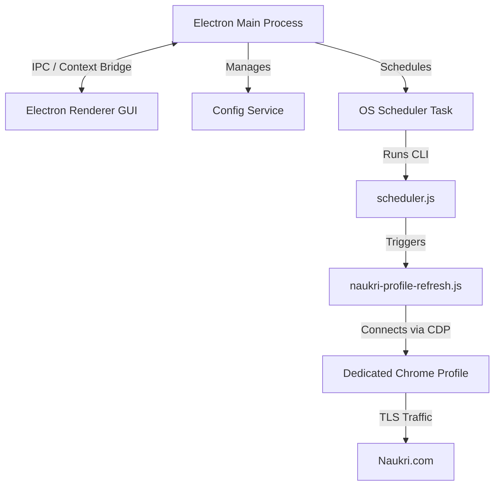

# Naukri Update: Developer Onboarding Roadmap & Walkthrough

Welcome to the developer documentation for **Naukri Update**. This guide is designed for contributors and developers wishing to build, test, extend, or package the application from source.

Unlike the zero-technical-setup experience delivered to normal users, this document explains the internal architecture, local development flows, packaging commands, and extension pathways.

---

## 1. High-Level System Architecture

Naukri Update utilizes a lightweight desktop frontend linked with a robust local automation runner. The key components are:

*   **Electron Main Process (`main.js`):** Manages the application lifecycle, tray icon integration, system startup auto-launch, native OS scheduler registrations, and context-isolated IPC channels.
*   **Electron Renderer (`renderer/`):** A modern, dark-mode web application (HTML/CSS/JS) that interacts with the user, triggers manual runs, displays real-time connection status, and reads local logs.
*   **Config Service (`config-service.js`):** A central service managing the migration of repo-based environments, schema validations, AppData directories, and plain-text credentials safety (e.g., setting `chmod 0600` on Unix systems).
*   **Playwright Engine (`naukri-profile-refresh.js`):** The core scraper/automator. It launches Google Chrome headlessly or headfully, attaches via Chrome DevTools Protocol (CDP) on port 9222, signs in, and modifies the headline text or uploads the resume PDF.
*   **Native Schedulers (`scripts/scheduler.js`):** A lightweight background checker executed every 15 minutes by native operating system utilities (Linux `crontab`, macOS `LaunchAgents`, or Windows Task Scheduler) to determine if a scheduled task is due.



---

## 2. Local Directory Layout

All application configs, resumes, browser caches, and log files are separated from the repository code for clean deployment.

*   **Repository Workspace:** Contains only source code, resource assets (icons), and development configurations.
*   **Application Data Directory (Platform Specific):**
    *   **Linux:** `~/.config/naukri-update/` or `~/.gemini/antigravity/` (under sandbox environment)
    *   **macOS:** `~/Library/Application Support/naukri-update/`
    *   **Windows:** `%APPDATA%\naukri-update\`
*   **Contents of AppData:**
    *   `.env`: The local environment config (holds Naukri credentials, scheduling times, and flags).
    *   `.naukri-chrome-profile/`: The dedicated Chrome browser profile (persists Naukri.com login cookies and caches).
    *   `resume/`: Folder where your authoritative resume PDF is copy-managed.
    *   `naukri-hourly-refresh.log` & `naukri-refresh.log`: Execution logs rotated automatically (keeps the last 5 runs).
    *   `.naukri-refresh-state.json`: Holds metadata about the last successful execution times.

---

## 3. From-Scratch Setup Walkthrough

To prepare your local machine for developing Naukri Update:

### Prerequisite Checklist
*   **Node.js:** Ensure Node.js (version 18 or above) is installed.
*   **npm:** Ensure npm is installed.
*   **Google Chrome:** The app connects to your system Chrome installation. Ensure Google Chrome is installed on the host.

### Step 1: Install Dependencies
Run the install command inside the repository root to fetch Electron and Playwright binaries:
```bash
npm install
```

### Step 2: Validate Environment Syntax & Schema
You can verify the configuration schema and validate settings syntax without launching the GUI:
```bash
node scripts/scheduler.js --validate
```

### Step 3: Launch in Development Mode
Launch Electron with the sandbox disabled (required on certain Linux kernels to attach to host Chrome instances):
```bash
npm start
```
This launches the Electron GUI window and initializes the system tray icon.

---

## 4. Build & Package Instructions

We use `electron-builder` to bundle and distribute Naukri Update as a standalone installer/executable.

### Command Quick-Reference

| Command | Action | Output Directory |
| :--- | :--- | :--- |
| `npm run pack` | Bundles the application folder structure without generating an installer (for testing). | `dist/` |
| `npm run dist` | Builds platform-specific installer binaries (AppImage/deb/exe/dmg). | `dist/` |

### Platform-Specific Builder Options
The build targets are defined in `package.json` under the `"build"` key:
*   **Linux:** Builds AppImage and `.deb` packages.
*   **Windows:** Builds a single NSIS executable.
*   **macOS:** Builds a `.dmg` and `.app` bundle.

To configure build properties, modify the `"build"` configuration block in [package.json](file:///home/anwar/Workspace/personal/naukri_update/package.json).

---

## 5. System Extension Guide

If you are extending the capabilities of Naukri Update, adhere to the following guidelines:

### Adding New IPC Channels
1.  **Define the handler** in `main.js` using `ipcMain.handle('your-channel-name', callback)`.
2.  **Expose the API** in `preload.js` under the `contextBridge.exposeInMainWorld('api', { ... })` mapping.
3.  **Invoke the channel** in the frontend code (`renderer/app.js`) using `await window.api.yourChannelName()`.

### Modifying the Scraper Logic
The Playwright automator is located in `naukri-profile-refresh.js`. When adding actions:
*   Use robust, text-based selectors or modern XPath patterns to survive Naukri markup changes.
*   Ensure that any operation includes a **verify step** (e.g., checking if the success toast exists or re-fetching the headline text from the page after saving).
*   Add verbose logging to standard streams. These streams are captured by the Electron app and written to the local log files.

### Security and Privacy Guidelines
*   **Zero-Exfiltration:** Never add third-party analytics, telemetry, or remote logging. The app must communicate only with your local storage and directly with `naukri.com`.
*   **File Hardening:** Always ensure that configuration files holding passwords are created with restricted file permissions (`fs.writeFileSync` using mode `0o600` on Unix systems) to prevent local privilege escalation attacks.
*   **Credential Handling:** Never write plaintext credentials to the log files. Ensure that passwords are removed/redacted before logs are written to the AppData directory.
